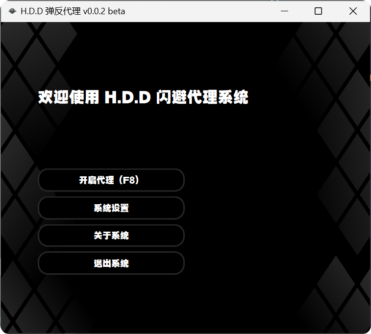

# H.D.D-BounceProxy
 绝区零自动弹反系统
 

## 特性
* 支持视觉检测/音频检测
* 自定义弹反招式
* 支持键盘/手柄
* 增加 GUI

## 使用

下载：`git clone https://github.com/Moxiner/H.D.D-BounceProxy.git`

环境安装：`./install.bat`

启动：`./run.bat`

# 致谢
本项目引用以下开源项目，感谢他们对开源项目做出的贡献。

视觉提供: [绝区零》自动招架，以及闪避实现方法，基于python](https://www.bilibili.com/video/BV1QUb6eYEA5/?share_source=copy_web&vd_source=cb6401bb53217ef7b31c26ec63b95347) - By: [西瓜加糖精](https://space.bilibili.com/321123985)

音频提供: [ZZZSoundTrigger](https://github.com/ImLaoBJie/ZZZSoundTrigger) - By: [ImLaoBJie](https://github.com/ImLaoBJie)

GUI 提供: [H.D.D-System](https://github.com/PPicku/H.D.D-System) - By: [PPicku](https://github.com/PPicku)