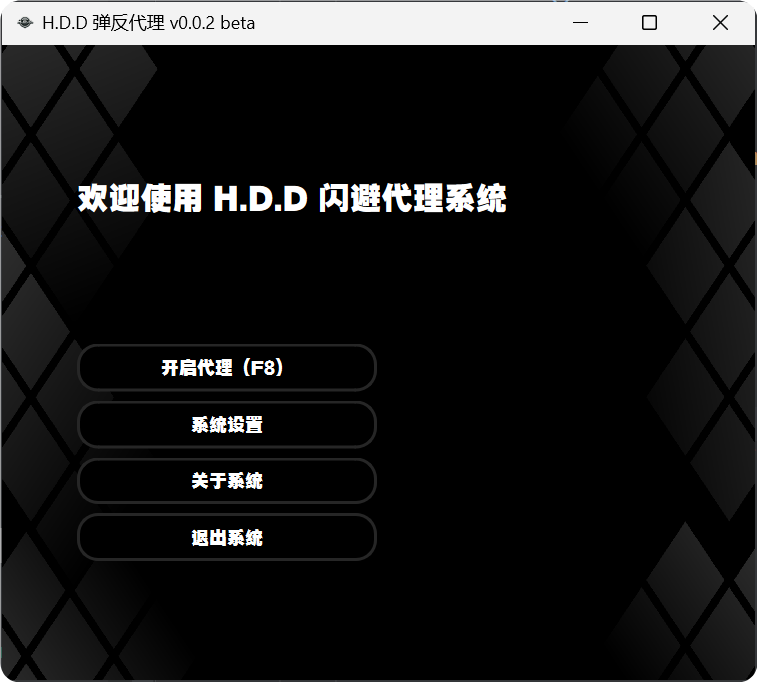

<p align="center">
  
</p>
  <h1 align="center">
  H.D.D-BounceProxy
</h1>
<p align="center">
  绝区零自动弹反系统 | 多种检测方式 | 多种操作方式 | 多种弹反招式
</p>


<div align="center">


</div>

 



## 特性
* 支持视觉检测/音频检测
* 自定义弹反招式
* 支持键盘/手柄
* 增加 GUI

## 使用

#### 下载：[Python 3.11.6](https://mirrors.aliyun.com/python-release/windows/python-3.11.6-amd64.exe)
> [!IMPORTANT]
> 请务必使用 Python 3.11.6，其他版本安装模块可能会有问题

### 安装 Python 3.11.6 
> [!IMPORTANT]
> 安装 Python 时请勾选 Add to PATH

#### 打开 Windows 终端输入以下指令: 

* 克隆项目
```
git clone https://github.com/Moxiner/H.D.D-BounceProxy.git
```

* 切换到项目目录
```
cd H.D.D-BounceProxy 
```   

* 环境安装
```
// 使用脚本安装
./install.bat

// 手动安装
// 1. 使用清华源更新 pip
python -m pip install -i https://mirrors.aliyun.com/pypi/simple/ --upgrade pip

// 2. 使用 pip 清华源安装模块
pip install -r requirements.txt -i  https://mirrors.aliyun.com/pypi/simple/

// 3. 安装字体
copy ".\Font\black.ttf" "%windir%\Fonts" > nul
// 4. 刷新字体缓存
rundll32.exe /s %windir%\System32\spool\DRIVERS\Color\fontcache.dll
```

* 启动（以管理员方式启动）
```
./run.bat    
```

* 在游戏中将攻击的辅助键位设置为 `Y`

# 额外的协议
本项目遵守 [GPL-v3 协议](./LICENSE) 以下为附加协议内容
> [!CAUTION] 
> 本项目完全开源免费！
> 如果你是买来的，可凭此截图退款！
> 拒绝退款的，请举报该商家！
> 必要时请使用法律武器维护自己的合法权益！
> 本项目严禁任何人打着幌子倒卖或收取知识费，服务费，安装费等！


# 致谢

## 引用开源仓库

本项目引用以下开源项目，感谢他们对开源社区做出的贡献。

视觉提供: [《绝区零》自动招架，以及闪避实现方法，基于python](https://www.bilibili.com/video/BV1QUb6eYEA5/?share_source=copy_web&vd_source=cb6401bb53217ef7b31c26ec63b95347) - By: [西瓜加糖精](https://space.bilibili.com/321123985)

音频提供: [ZZZSoundTrigger](https://github.com/ImLaoBJie/ZZZSoundTrigger) - By: [ImLaoBJie](https://github.com/ImLaoBJie)

GUI 提供: [H.D.D-System](https://github.com/PPicku/H.D.D-System) - By: [PPicku](https://github.com/PPicku)

GUI 框架提供: [PyQt-Fluent-Widgets](https://github.com/zhiyiYo/PyQt-Fluent-Widgets) - By: [zhiyiYo](https://github.com/zhiyiYo)

## 赞助者名单

本项目的发展离不开您的支持，谢谢你们的支持！（此捐赠名单按捐赠时间排序）
|序号| 捐赠者 | 捐赠留言 | 
|:--:| :--: | :-- |
|1| 烦烦 | 该用户很神秘，没有留言 |
|2| 波奇的摇滚吉他 | 做大做强 |
|3| 东汉****主任 | 该用户很神秘，没有留言 |
|4| Shepherd | 该用户很神秘，没有留言 |